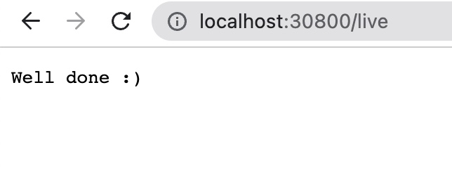
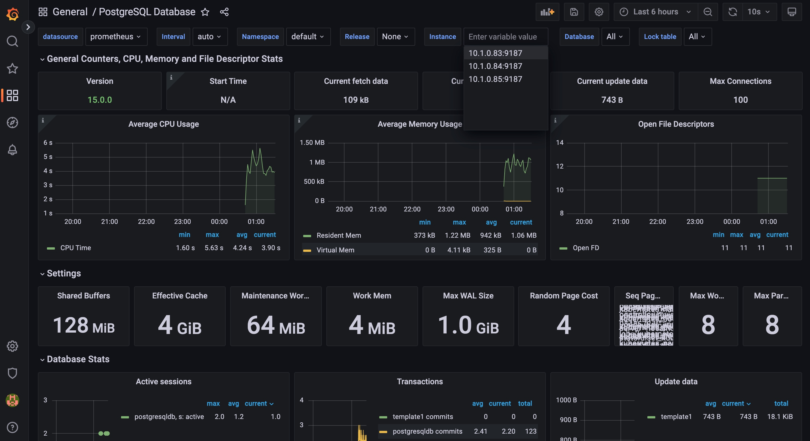

# simple-service
## Services diagram

## Working steps
1. Dockerfile simple-service:
- [x] Use `k8s/simple-service/Dockerfile` to build image named `simple-serivce:v1.0.0`.
- [x] Use multi-stage for image size optimization (~12MB).
2. Dockerfile Postgres image with SSL enabled:
- [x] Use below script to create new self-signed certificate:
```
--CA
openssl genrsa 2048 > ca.key
openssl req -new -x509 -nodes -days 365000 -key ca.key -out ca.cert
--server
openssl req -newkey rsa:2048 -nodes -days 365000 -keyout server.key -out server.csr
openssl x509 -req -days 365000 -set_serial 01 -in server.csr -out server.cert -CA ca.cert -CAkey ca.key
```
- [x] Use `k8s/postgresql/Dockerfile` to build SSL enabled PostgresDB image - `postgres-ssl:v1.0.0`.
3. Deploy to k8s cluster:
- [x] Replace `minikube` by `docker-desktop` with Kubernetes enabled.
- [x] Deploy `simple-service` with HorizontalPodAutoscaler configured for scaling based on Pod metrics. Expose to NodePort service.
- [x] Deploy `postgres-db` StatefulSet with 3 replicas.
- [x] Connect to the app and connect it to the database.

4. Deploy monitoring with Prometheus and Grafana:
- [x] Update `postgres-db` StatefulSet for adding `postgres-exporter` sidecar.
- [x] Create Prometheus Depoyment and scrape Postgres metrics from sidecar container.
- [x] Create Grafana Deployment. Show metrics from Prometheus data-source with the dashboard template id `9628` (for PostgresDB).
